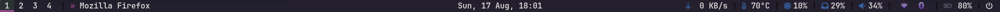
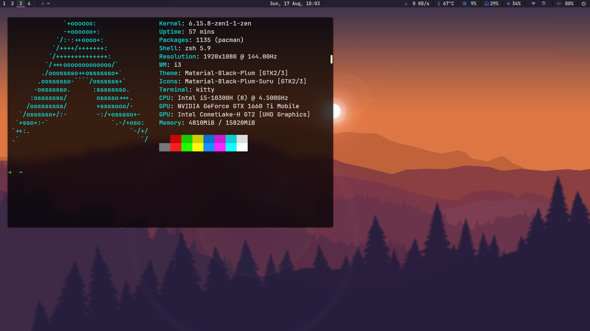
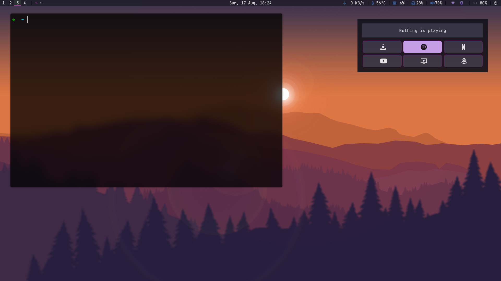
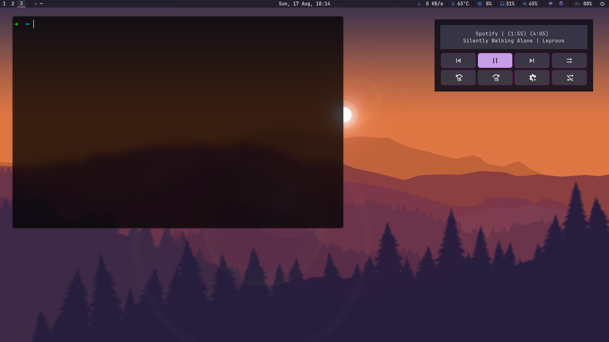
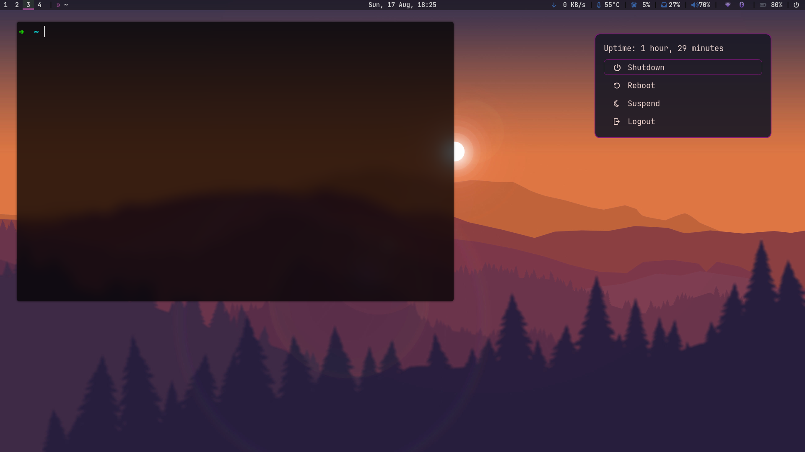

# My First Arch Linux Rice

Welcome to my dotfiles repository! This project documents my very first journey into the world of Linux, where I decided to dive headfirst into Arch Linux without a traditional desktop environment. This is not just my first Linux setup, but also my first attempt at "ricing" - customizing the user interface to be both beautiful and functional.

As a newcomer, many of these configurations are heavily inspired by or directly adapted from the work of others. I've done my best to customize them to my liking and have even added a few scripts of my own.

[Go to Screenshots](#screenshots)

## Key Components

*   **Window Manager:** i3 ([View keybindings](home/config/i3/shortcuts.md))
*   **Bar:** Polybar (I got it from somebody I don’t remember, but anyway, I made quite a lot of changes)
*   **Launcher:** Rofi (Some of them from [adi1090x](https://github.com/adi1090x/rofi))
*   **Compositor:** Picom ([animation and transparency](https://github.com/Juicyyyyyyy/dotfiles/tree/master/picom))
*   **Login Manager:** LightDM (from [mino29](https://github.com/mino29/ghostly-greeter) with some modifications)
*   **GRUB Theme:** A custom theme (from [mino29](https://github.com/mino29/tokyo-night-grub))

---

## My Personal Touch

While I learned a lot from existing dotfiles, I wanted to add my own creative solutions to the mix. Here are some of the features I did my own:

### 🎨 Dynamic Wallpaper System

I created a simple wallpaper management system that allows me to switch between different wallpaper "themes" or folders with shortcut. It is combined with `feh`

*   **Location:** `home/config/i3/wallpaper/`
*   **How it works:**
    *   `wallpaper-paths.json`: This file defines the root path for wallpapers and lists the available theme directories (e.g., "abstract", "plain").
    *   `get-wallpaper-path.py`: A Python script that reads the JSON file. It can be called with an argument to either get the current theme's wallpaper path or cycle to the next theme.
*   **i3 Keybindings:**
    *   `$mod+p`: Sets a random wallpaper from the *current* theme directory.
    *   `$mod+Shift+p`: Switches to the *next* wallpaper theme and then sets a random wallpaper.

### 🚀 Custom Rofi Menus

I built a couple of custom, interactive menus using Rofi to streamline my workflow.

#### 1. Power Menu

*   **Location:** `home/config/rofi/power-menu/power-menu.sh`
*   **Features:**
    *   A clean, simple menu for Shutdown, Reboot, Suspend, Logout, and Lock.
    *   Displays system uptime.
    *   Includes a confirmation step for critical actions to prevent accidents.
    *   Triggered with `$mod+bracketright`.

#### 2. Media Player Controller

*   **Location:** `home/config/rofi/media-player/`
*   **Features:**
    *   **Multi-Player Control:** Uses `playerctl` to control various media players (Spotify, VLC, browsers).
    *   **Player Switching:** If multiple players are active, you can cycle through them.
    *   **Rich Controls:** Provides buttons for play/pause, next/previous, and seeking. For Spotify and VLC, it also includes toggles for shuffle and repeat.
    *   **Launchers:** If no player is active, it displays options to launch common media apps like Spotify, YouTube, Netflix, etc in app style with `chromium`.
    *   Triggered with `$mod+m`.

### 📝 Worth to Mention
- [`greenclip`](https://github.com/erebe/greenclip) and `xclip` for clipboard management
- `scrot` for screenshot with XF86Calculator (Fn+KP_Enter in my keyboard)
- it needs `light-locker` for locking along with `lightDM`

#### What I Really Liked About It!

- I really loved figuring out media-player.sh and the script changing wallpaper or theme with one shortcut. 
- Tinker and check others polybar/i3 configs and figure out how to adapt specific thing for my setup.

#### What Is Not Feel Right?

- Notification with `dunst` needs proper polishing and review.
- `Alt+Tab` is not working exactly what i want.
- I really need to organize my rofi themes folder.

---

## Credits and Special Thanks

*   **[mino29](https://github.com/mino29):** For the awesome setups with beginner friendly instructions `ghostly-greeter` and  `tokyo-night-grub`. I've only made minor modifications to them.
*   **[adi1090x](https://github.com/adi1090x):** For the versatile and beautiful Rofi themes. Some of my menus are built upon his styles.

A general **special thanks** to everyone in the ricing community whose dotfiles I've get inspriaton from. Your creativity and willingness to share are what make the Linux experience so special.

## Screenshots

polybar:

kitty:

media player none:

media player spotify:

power menu:

[Go Back to Top](#my-first-arch-linux-rice)